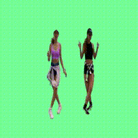
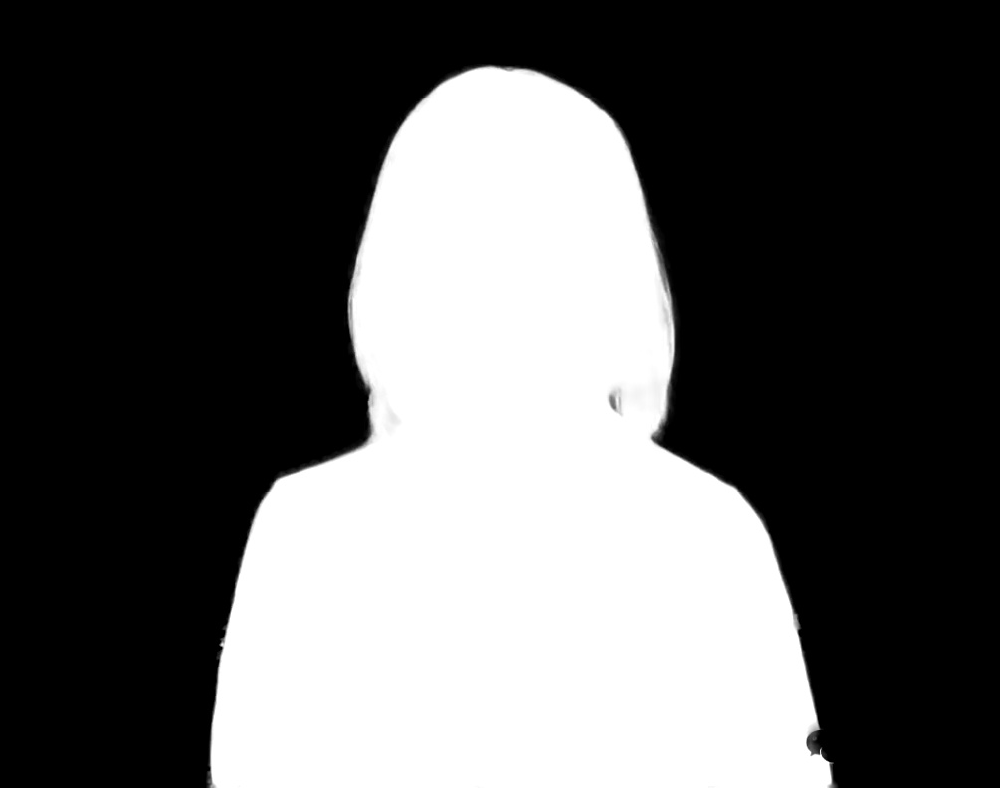

## RobustVideoMatting.lite.ai.toolkit 🚀🚀🌟  
<div align='left'>
  
  
  
</div>

## 1. 简介  
使用Lite.AI.ToolKit C++工具箱来跑RobustVideoMatting的一些案例(https://github.com/DefTruth/lite.ai.toolkit) ，ONNXRuntime、MNN、NCNN和TNN四个版本。

<div align='center'>
  
    
  
  
  <br>
  
    
  
  
</div>

若是有用，❤️不妨给个⭐️🌟支持一下吧~ 🙃🤪🍀  

## 2. C++版本源码

RobustVideoMatting C++ 版本的源码包含ONNXRuntime、MNN、NCNN和TNN四个版本，可以在 [lite.ai.toolkit](https://github.com/DefTruth/lite.ai.toolkit) 工具箱中找到。本项目主要介绍如何基于 [lite.ai.toolkit](https://github.com/DefTruth/lite.ai.toolkit) 工具箱，直接使用RobustVideoMatting实现视频抠图和图片抠图。需要说明的是，本项目是基于MacOS下编译的 [liblite.ai.toolkit.v0.1.0.dylib](https://github.com/DefTruth/RobustVideoMatting.lite.ai.toolkit/blob/main/lite.ai.toolkit/lib) 来实现的，对于使用MacOS的用户，可以直接下载本项目包含的*liblite.ai.toolkit.v0.1.0*动态库和其他依赖库进行使用。而非MacOS用户，则需要从[lite.ai.toolkit](https://github.com/DefTruth/lite.ai.toolkit) 中下载源码进行编译。[lite.ai.toolkit](https://github.com/DefTruth/lite.ai.toolkit) c++工具箱的编译已经在MacOS/Linux/Windows下编译测试通过，支持CPU和GPU环境，目前包含70+流行的开源模型。
 * [rvm.cpp](https://github.com/DefTruth/lite.ai.toolkit/blob/main/lite/ort/cv/rvm.cpp)
 * [rvm.h](https://github.com/DefTruth/lite.ai.toolkit/blob/main/lite/ort/cv/rvm.h)
 * [mnn_rvm.cpp](https://github.com/DefTruth/lite.ai.toolkit/blob/main/lite/mnn/cv/mnn_rvm.cpp)
 * [mnn_rvm.h](https://github.com/DefTruth/lite.ai.toolkit/blob/main/lite/mnn/cv/mnn_rvm.h)
 * [ncnn_rvm.cpp](https://github.com/DefTruth/lite.ai.toolkit/blob/main/lite/ncnn/cv/ncnn_rvm.cpp)
 * [ncnn_rvm.h](https://github.com/DefTruth/lite.ai.toolkit/blob/main/lite/ncnn/cv/ncnn_rvm.h)
 * [tnn_rvm.cpp](https://github.com/DefTruth/lite.ai.toolkit/blob/main/lite/tnn/cv/tnn_rvm.cpp)
 * [tnn_rvm.h](https://github.com/DefTruth/lite.ai.toolkit/blob/main/lite/tnn/cv/tnn_rvm.h)

NCNN版本的测试没有通过，转换的模型可能有问题，这里先放出代码。这里案例使用的接口是默认版本，即ONNXRuntime. 目前ONNXRuntime、MNN和TNN版本均已测试通过。

## 3. 模型文件  

### 3.1 ONNX模型文件  
可以从我提供的链接下载 ([Baidu Drive](https://pan.baidu.com/s/1elUGcx7CZkkjEoYhTMwTRQ) code: 8gin) , 也可以从 [RobustVideoMatting](https://github.com/PeterL1n/RobustVideoMatting) 官方仓库下载。

|                Class                | Pretrained ONNX Files |              Rename or Converted From (Repo)              | Size  |
| :---------------------------------: | :-------------------: | :-------------------------------------------------------: | :---: |
| *lite::cv::matting::RobustVideoMatting* |   rvm_mobilenetv3_fp32.onnx   | [RobustVideoMatting](https://github.com/PeterL1n/RobustVideoMatting) | 14Mb |
| *lite::cv::matting::RobustVideoMatting* |   rvm_mobilenetv3_fp16.onnx   | [RobustVideoMatting](https://github.com/PeterL1n/RobustVideoMatting) | 7.2Mb |
| *lite::cv::matting::RobustVideoMatting* |   rvm_resnet50_fp32.onnx   | [RobustVideoMatting](https://github.com/PeterL1n/RobustVideoMatting) | 50Mb |
| *lite::cv::matting::RobustVideoMatting* |   rvm_resnet50_fp16.onnx   | [RobustVideoMatting](https://github.com/PeterL1n/RobustVideoMatting) | 100Mb |

### 3.2 MNN模型文件 
可以从我提供的链接下载 ([Baidu Drive](https://pan.baidu.com/s/1KyO-bCYUv6qPq2M8BH_Okg) code: 9v63) 

|                Class                | Pretrained MNN Files |              Rename or Converted From (Repo)              | Size  |
| :---------------------------------: | :-------------------: | :-------------------------------------------------------: | :---: |
| *lite::mnn::cv::matting::RobustVideoMatting* |   rvm_mobilenetv3_fp32.mnn   | [RobustVideoMatting](https://github.com/PeterL1n/RobustVideoMatting) | 14Mb |
| *lite::mnn::cv::matting::RobustVideoMatting* |   rvm_mobilenetv3_fp32-480-480.mnn   | [RobustVideoMatting](https://github.com/PeterL1n/RobustVideoMatting) | 14Mb |
| *lite::mnn::cv::matting::RobustVideoMatting* |   rvm_mobilenetv3_fp32-480-640.mnn   | [RobustVideoMatting](https://github.com/PeterL1n/RobustVideoMatting) | 14Mb |
| *lite::mnn::cv::matting::RobustVideoMatting* |   rvm_mobilenetv3_fp32-640-480.mnn   | [RobustVideoMatting](https://github.com/PeterL1n/RobustVideoMatting) | 14Mb |
| *lite::mnn::cv::matting::RobustVideoMatting* |   rvm_mobilenetv3_fp32-1080-1920.mnn   | [RobustVideoMatting](https://github.com/PeterL1n/RobustVideoMatting) | 14Mb |
| *lite::mnn::cv::matting::RobustVideoMatting* |   rvm_resnet50_fp32.mnn   | [RobustVideoMatting](https://github.com/PeterL1n/RobustVideoMatting) | 50Mb |
| *lite::mnn::cv::matting::RobustVideoMatting* |   rvm_resnet50_fp32-480-480.mnn   | [RobustVideoMatting](https://github.com/PeterL1n/RobustVideoMatting) | 50Mb |
| *lite::mnn::cv::matting::RobustVideoMatting* |   rvm_resnet50_fp32-480-640.mnn   | [RobustVideoMatting](https://github.com/PeterL1n/RobustVideoMatting) | 50Mb |
| *lite::mnn::cv::matting::RobustVideoMatting* |   rvm_resnet50_fp32-640-480.mnn   | [RobustVideoMatting](https://github.com/PeterL1n/RobustVideoMatting) | 50Mb |
| *lite::mnn::cv::matting::RobustVideoMatting* |   rvm_resnet50_fp32-1080-1920.mnn   | [RobustVideoMatting](https://github.com/PeterL1n/RobustVideoMatting) | 50Mb |

### 3.3 NCNN模型文件 
可以从我提供的链接下载 ([Baidu Drive](https://pan.baidu.com/s/1hlnqyNsFbMseGFWscgVhgQ) code: sc7f)

|                Class                | Pretrained NCNN Files |              Rename or Converted From (Repo)              | Size  |
| :---------------------------------: | :-------------------: | :-------------------------------------------------------: | :---: |
| *lite::ncnn::cv::matting::RobustVideoMatting* |   rvm_mobilenetv3_fp32-opt.param&bin   | [RobustVideoMatting](https://github.com/PeterL1n/RobustVideoMatting) | 14Mb |
| *lite::ncnn::cv::matting::RobustVideoMatting* |   rvm_mobilenetv3_fp32-480-480-opt.param&bin   | [RobustVideoMatting](https://github.com/PeterL1n/RobustVideoMatting) | 14Mb |
| *lite::ncnn::cv::matting::RobustVideoMatting* |   rvm_mobilenetv3_fp32-480-640-opt.param&bin   | [RobustVideoMatting](https://github.com/PeterL1n/RobustVideoMatting) | 14Mb |
| *lite::ncnn::cv::matting::RobustVideoMatting* |   rvm_mobilenetv3_fp32-640-480-opt.param&bin   | [RobustVideoMatting](https://github.com/PeterL1n/RobustVideoMatting) | 14Mb |
| *lite::ncnn::cv::matting::RobustVideoMatting* |   rvm_mobilenetv3_fp32-1080-1920-opt.param&bin   | [RobustVideoMatting](https://github.com/PeterL1n/RobustVideoMatting) | 14Mb |
| *lite::ncnn::cv::matting::RobustVideoMatting* |   rvm_resnet50_fp32-opt.param&bin   | [RobustVideoMatting](https://github.com/PeterL1n/RobustVideoMatting) | 50Mb |
| *lite::ncnn::cv::matting::RobustVideoMatting* |   rvm_resnet50_fp32-480-480-opt.param&bin   | [RobustVideoMatting](https://github.com/PeterL1n/RobustVideoMatting) | 50Mb |
| *lite::ncnn::cv::matting::RobustVideoMatting* |   rvm_resnet50_fp32-480-640-opt.param&bin   | [RobustVideoMatting](https://github.com/PeterL1n/RobustVideoMatting) | 50Mb |
| *lite::ncnn::cv::matting::RobustVideoMatting* |   rvm_resnet50_fp32-640-480-opt.param&bin   | [RobustVideoMatting](https://github.com/PeterL1n/RobustVideoMatting) | 50Mb |
| *lite::ncnn::cv::matting::RobustVideoMatting* |   rvm_resnet50_fp32-1080-1920-opt.param&bin   | [RobustVideoMatting](https://github.com/PeterL1n/RobustVideoMatting) | 50Mb |

### 3.4 TNN模型文件
可以从我提供的链接下载 ([Baidu Drive](https://pan.baidu.com/s/1lvM2YKyUbEc5HKVtqITpcw) code: 6o6k)

|                Class                | Pretrained TNN Files |              Rename or Converted From (Repo)              | Size  |
| :---------------------------------: | :-------------------: | :-------------------------------------------------------: | :---: |
| *lite::tnn::cv::matting::RobustVideoMatting* |   rvm_mobilenetv3_fp32-480-480-sim.tnnproto&tnnmodel   | [RobustVideoMatting](https://github.com/PeterL1n/RobustVideoMatting) | 14Mb |
| *lite::tnn::cv::matting::RobustVideoMatting* |   rvm_mobilenetv3_fp32-480-640-sim.tnnproto&tnnmodel   | [RobustVideoMatting](https://github.com/PeterL1n/RobustVideoMatting) | 14Mb |
| *lite::tnn::cv::matting::RobustVideoMatting* |   rvm_mobilenetv3_fp32-640-480-sim.tnnproto&tnnmodel   | [RobustVideoMatting](https://github.com/PeterL1n/RobustVideoMatting) | 14Mb |
| *lite::tnn::cv::matting::RobustVideoMatting* |   rvm_mobilenetv3_fp32-1080-1920-sim.tnnproto&tnnmodel   | [RobustVideoMatting](https://github.com/PeterL1n/RobustVideoMatting) | 14Mb |
| *lite::tnn::cv::matting::RobustVideoMatting* |   rvm_resnet50_fp32-480-480-sim.tnnproto&tnnmodel   | [RobustVideoMatting](https://github.com/PeterL1n/RobustVideoMatting) | 50Mb |
| *lite::tnn::cv::matting::RobustVideoMatting* |   rvm_resnet50_fp32-480-640-sim.tnnproto&tnnmodel   | [RobustVideoMatting](https://github.com/PeterL1n/RobustVideoMatting) | 50Mb |
| *lite::tnn::cv::matting::RobustVideoMatting* |   rvm_resnet50_fp32-640-480-sim.tnnproto&tnnmodel   | [RobustVideoMatting](https://github.com/PeterL1n/RobustVideoMatting) | 50Mb |
| *lite::tnn::cv::matting::RobustVideoMatting* |   rvm_resnet50_fp32-1080-1920-sim.tnnproto&tnnmodel   | [RobustVideoMatting](https://github.com/PeterL1n/RobustVideoMatting) | 50Mb |


## 4. 接口文档

在[lite.ai.toolkit](https://github.com/DefTruth/lite.ai.toolkit) 中，RobustVideoMatting的实现类为：

```c++
class LITE_EXPORTS lite::cv::matting::RobustVideoMatting;
class LITE_EXPORTS lite::mnn::cv::matting::RobustVideoMatting;
class LITE_EXPORTS lite::tnn::cv::matting::RobustVideoMatting;
class LITE_EXPORTS lite::ncnn::cv::matting::RobustVideoMatting;
```

该类型目前包含两个公共接口，分别是`detect`和`detect_video`，前者用于图像抠图，后者用于视频抠图。不同推理引擎的实现，接口基本相同。TNN、MNN和NCNN版本的接口不含downsample_ratio，因为转换时，我是按照静态维度转换的，并且在转换模型时固定了一个合适的downsample_ratio，不需要再推理时再设置。具体区别可以跳转到c++实现的源码查看。  
```c++
     /**
     * Image Matting Using RVM(https://github.com/PeterL1n/RobustVideoMatting)
     * @param mat: cv::Mat BGR HWC
     * @param content: types::MattingContent to catch the detected results.
     * @param downsample_ratio: 0.25 by default.
     * See https://github.com/PeterL1n/RobustVideoMatting/blob/master/documentation/inference_zh_Hans.md
     */
    void detect(const cv::Mat &mat, types::MattingContent &content,
                float downsample_ratio = 0.25f);
    /**
     * Video Matting Using RVM(https://github.com/PeterL1n/RobustVideoMatting)
     * @param video_path: eg. xxx/xxx/input.mp4
     * @param output_path: eg. xxx/xxx/output.mp4
     * @param contents: vector of MattingContent to catch the detected results.
     * @param save_contents: false by default, whether to save MattingContent.
     * @param downsample_ratio: 0.25 by default.
     * See https://github.com/PeterL1n/RobustVideoMatting/blob/master/documentation/inference_zh_Hans.md
     * @param writer_fps: FPS for VideoWriter, 20 by default.
     */
    void detect_video(const std::string &video_path,
                      const std::string &output_path,
                      std::vector<types::MattingContent> &contents,
                      bool save_contents = false,
                      float downsample_ratio = 0.25f,
                      unsigned int writer_fps = 20);
```  

* `detect`接口输入参数说明：
  * mat: cv::Mat BGR格式图像
  * content: types::MattingContent类型，用来保存检测的结果，包含类型为cv::Mat的三个成员，分别是
    * `fgr_mat`: `cv::Mat (H,W,C=3) BGR` 格式，值范围为0~255 的 `CV_8UC3`, 用于保存估计的前景
    * `pha_mat`:` cv::Mat (H,W,C=1)` 值范围为0.~1.的 `CV_32FC1`, 用于保存估计的alpha(matte)值
    * `merge_mat`: `cv::Mat (H,W,C=3) BGR` 格式，值范围为0~255 的 `CV_8UC3`, 用于保存根据pha融合前景背景的合成图像  
    * `flag`: bool 类型标志位，表示是否检测成功
  * downsample_ratio: float，下采样比率，默认0.25f，值的设置可以参考[官方文档](https://github.com/PeterL1n/RobustVideoMatting/blob/master/documentation/inference_zh_Hans.md) , 如下：

    | 分辨率         | 人像           | 全身            |
    | ------------- | ------------- | -------------- |
    | <= 512x512    | 1             | 1              |
    | 1280x720      | 0.375         | 0.6            |
    | 1920x1080     | 0.25          | 0.4            |
    | 3840x2160     | 0.125         | 0.2            |

    模型在内部将高分辨率输入缩小做初步的处理，然后再放大做细分处理。 建议设置 `downsample_ratio` 使缩小后的分辨率维持在 256 到 512 像素之间. 例如，`1920x1080` 的输入用 `downsample_ratio=0.25`，缩小后的分辨率 `480x270` 在 256 到 512 像素之间。 根据视频内容调整 `downsample_ratio`。若视频是上身人像，低 `downsample_ratio` 足矣。若视频是全身像，建议尝试更高的 `downsample_ratio`。但注意，过高的 `downsample_ratio` 反而会降低效果。


* `detect_video`接口输入参数说明：   
  * video_path: string, 输入的视频路径
  * output_path: string, 输出的视频路径  
  * contents：MattingContent类型的vector，用来保存每帧检测的结果  
  * save_contents：bool，是否保存每一帧的结果，默认false。当分辨率很大时，保存所有的结果将会占用非常多内存
  * downsample_ratio: float，下采样比率，默认0.25f，同上。
  * writer_fps：int 视频写出的帧率，默认20
    
## 5. 使用案例  
这里测试使用的是mobilenetv3版本的rvm模型，如果你使用resnet50版本的模型，将会得到更高精度的结果。  

### 5.1 图像抠图案例  

```c++
#include "lite/lite.h"

// Image Matting Interface
static void test_image()
{
  std::string onnx_path = "../hub/onnx/cv/rvm_mobilenetv3_fp32.onnx";
  std::string img_path = "../examples/lite/resources/test.jpg";
  std::string save_fgr_path = "../logs/test_lite_rvm_fgr.jpg";
  std::string save_pha_path = "../logs/test_rvm_pha.jpg";
  std::string save_merge_path = "../logs/test_lite_rvm_merge.jpg";

  auto *rvm = new lite::matting::RobustVideoMatting(onnx_path, 16); // 16 threads
  lite::types::MattingContent content;
  cv::Mat img_bgr = cv::imread(img_path);

  // 1. image matting.
  rvm->detect(img_bgr, content, 0.25f);

  if (content.flag)
  {
    if (!content.fgr_mat.empty()) cv::imwrite(save_fgr_path, content.fgr_mat); // 预测的前景fgr
    if (!content.pha_mat.empty()) cv::imwrite(save_pha_path, content.pha_mat * 255.); // 预测的前景pha
    if (!content.merge_mat.empty()) cv::imwrite(save_merge_path, content.merge_mat); // 合成图
  }
  
  delete rvm;
}

```  
* 输出结果为: (依次为原图、预测的pha、预测的前景fgr、合成图)

<div align='center'>
  
  
  
  
</div>

### 5.2 视频抠图案例  

#### 5.2.1 ONNXRuntime版本
```c++

#include "lite/lite.h"

// Video Matting Interface
static void test_video()
{
  std::string onnx_path = "../hub/onnx/cv/rvm_mobilenetv3_fp32.onnx";
  std::string video_path = "../examples/lite/resources/tesla.mp4";
  std::string output_path = "../logs/tesla_onnx.mp4";

  auto *rvm = new lite::cv::matting::RobustVideoMatting(onnx_path, 16); // 16 threads
  std::vector<lite::types::MattingContent> contents;

  // 1. video matting.
  rvm->detect_video(video_path, output_path, contents, false, 0.4f);

  delete rvm;
}

```  

#### 5.2.2 MNN版本  
```c++
static void test_mnn()
{
#ifdef ENABLE_MNN
  std::string mnn_path = "../hub/mnn/cv/rvm_mobilenetv3_fp32-480-640.mnn";
  std::string video_path = "../examples/lite/resources/tesla.mp4";
  std::string output_path = "../logs/tesla_mnn.mp4";

  auto *rvm = new lite::mnn::cv::matting::RobustVideoMatting(mnn_path, 16, 0); // 16 threads
  std::vector<lite::types::MattingContent> contents;

  // 1. video matting.
  rvm->detect_video(video_path, output_path, contents, false);

  delete rvm;
#endif
}
```
#### 5.2.3 TNN版本
```C++
static void test_tnn()
{
#ifdef ENABLE_TNN

  std::string proto_path = "../hub/tnn/cv/rvm_mobilenetv3_fp32-480-480-sim.opt.tnnproto";
  std::string model_path = "../hub/tnn/cv/rvm_mobilenetv3_fp32-480-480-sim.opt.tnnmodel";
  std::string video_path = "../examples/lite/resources/test_lite_rvm_1.mp4";
  std::string output_path = "../logs/test_lite_rvm_1_tnn.mp4";

  auto *rvm = new lite::tnn::cv::matting::RobustVideoMatting(
      proto_path, model_path, 16); // 16 threads
  std::vector<lite::types::MattingContent> contents;

  // 1. video matting.
  rvm->detect_video(video_path, output_path, contents, false);

  delete rvm;
#endif
}
```

* 输出结果为：  

<div align='center'>
  
    
  
  
  <br>
  
    
  
  
</div>

## 6. 编译运行    
在MacOS下可以直接编译运行本项目，无需下载其他依赖库。其他系统则需要从[lite.ai.toolkit](https://github.com/DefTruth/lite.ai.toolkit) 中下载源码先编译*lite.ai.toolkit.v0.1.0*动态库。  
```shell
git clone --depth=1 https://github.com/DefTruth/RobustVideoMatting.lite.ai.toolkit.git
cd RobustVideoMatting.lite.ai.toolkit 
sh ./build.sh
```    
* CMakeLists.txt设置
```cmake
cmake_minimum_required(VERSION 3.17)
project(RobustVideoMatting.lite.ai.toolkit)

set(CMAKE_CXX_STANDARD 11)

# setting up lite.ai.toolkit
set(LITE_AI_DIR ${CMAKE_SOURCE_DIR}/lite.ai.toolkit)
set(LITE_AI_INCLUDE_DIR ${LITE_AI_DIR}/include)
set(LITE_AI_LIBRARY_DIR ${LITE_AI_DIR}/lib)
include_directories(${LITE_AI_INCLUDE_DIR})
link_directories(${LITE_AI_LIBRARY_DIR})

set(OpenCV_LIBS
        opencv_highgui
        opencv_core
        opencv_imgcodecs
        opencv_imgproc
        opencv_video
        opencv_videoio
        )
# add your executable
set(EXECUTABLE_OUTPUT_PATH ${CMAKE_SOURCE_DIR}/examples/build)

add_executable(lite_rvm examples/test_lite_rvm.cpp)
target_link_libraries(lite_rvm
        lite.ai.toolkit
        onnxruntime
        MNN  # need, if built lite.ai.toolkit with ENABLE_MNN=ON,  default OFF
        ncnn # need, if built lite.ai.toolkit with ENABLE_NCNN=ON, default OFF
        TNN  # need, if built lite.ai.toolkit with ENABLE_TNN=ON,  default OFF
        ${OpenCV_LIBS})  # link lite.ai.toolkit & other libs.
```


* building && testing information:  
```shell
-- Generating done
-- Build files have been written to: /Users/xxx/Desktop/xxx/RobustVideoMatting.lite.ai.toolkit/examples/build
[ 50%] Building CXX object CMakeFiles/lite_rvm.dir/examples/test_lite_rvm.cpp.o
[100%] Linking CXX executable lite_rvm
[100%] Built target lite_rvm
Testing Start ...
Load ../hub/onnx/cv/rvm_mobilenetv3_fp32.onnx done!
write done! 1/774 done!
write done! 2/774 done!
write done! 3/774 done!
write done! 4/774 done!
write done! 5/774 done!
write done! 6/774 done!
...
write done! 724/774 done!
Testing Successful !
```  

